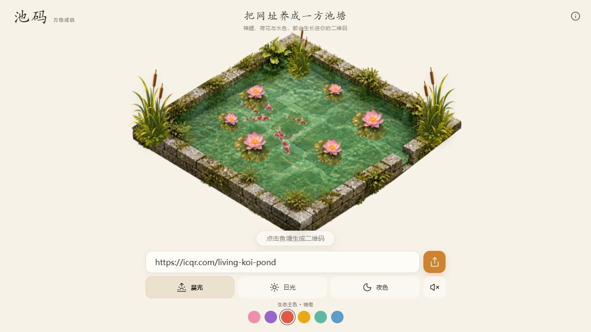
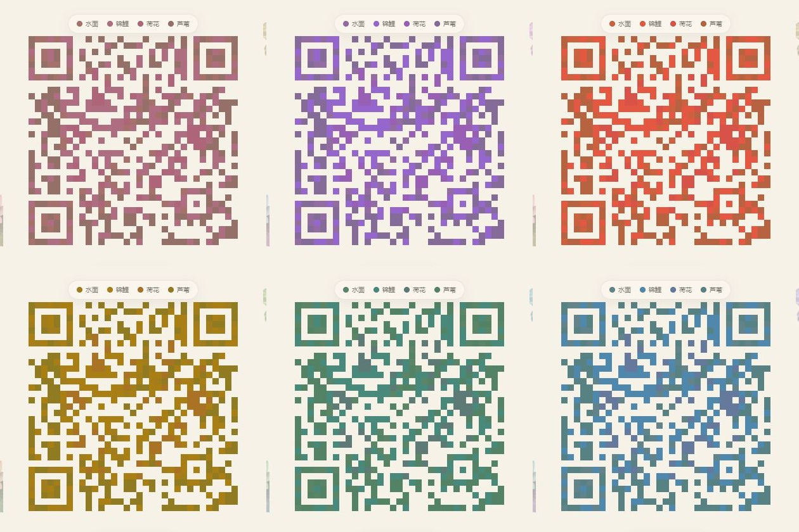
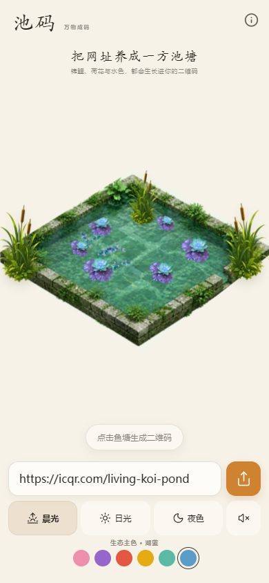

# 池码｜会生长的生态二维码

池码是一个将网址转化为动态锦鲤鱼塘与生态像素二维码的前端实验。

输入不同网址后，锦鲤数量、荷花分布、生态色彩和二维码模块都会发生确定性的变化。同一个网址会生成稳定一致的鱼塘与二维码。

详细的架构、视觉素材生成与抠图流程、生态算法、动画状态和扩展方式请参阅[实现文档](docs/IMPLEMENTATION.md)。

## 核心功能

- 动态锦鲤、荷花、芦苇与水面涟漪
- 网址驱动的鱼塘生命分布
- 鱼塘到二维码的生态像素聚合动画
- 晨光、日光、夜色三种光线环境
- 樱粉、鸢紫、锦橙、日金、荷青、湖蓝六种生态主色
- 水面、锦鲤、荷花、芦苇与二维码模块的颜色映射
- 响应式桌面端与移动端布局
- 高容错、可实际扫描的彩色二维码
- 可分享的 URL 状态编码

## 运行效果

### 中文首页

网址会稳定生成专属锦鲤、荷花、芦苇、水面色彩与生态二维码。



### 湖蓝生态二维码

二维码会继承鱼塘的主色、生态元素和网址种子，不是独立生成的固定配色。


### 六套生态主色

樱粉、鸢紫、锦橙、日金、荷青和湖蓝会同步作用于鱼塘与二维码。



### 移动端

<p align="center">
  
</p>

## 技术栈

- React 19
- Vite 6
- Canvas 2D
- `qrcode`
- Lucide React

## 本地运行

需要安装 Node.js 18 或更高版本。

```bash
npm install
npm run dev
```

开发服务器默认由 Vite 启动。打开终端输出的本地地址即可访问。

## 构建

```bash
npm run build
```

构建产物会生成在 `dist/` 目录，同时准备站点托管所需的 Worker 文件。

## 测试

```bash
npm run test:sites
```

测试覆盖静态资源访问、SPA 路由回退、API/写请求边界以及托管文件完整性。

## 项目结构

```text
src/
  App.jsx          核心交互、生态生成与二维码绘制
  styles.css       页面视觉、动画与响应式布局
  main.jsx         React 入口
public/assets/
  koi-pond/        鱼塘、锦鲤、荷花和芦苇素材
worker/
  index.js         静态站点 Worker
tests/
  sites-worker.test.mjs
```

## 生态映射规则

网址会被转换为稳定的哈希种子，用于决定：

1. 锦鲤与荷花的数量和位置。
2. 水面、锦鲤、荷花、芦苇在二维码中的模块分布。
3. 聚合动画的粒子起点与排列顺序。
4. 鱼塘与二维码的细微色相变化。

用户选择的生态主色是二维码的颜色锚点，光线环境只调整辅助生态色与明暗关系，不会改变所选主色的基本色相。

## 扫码可靠性

二维码使用高容错等级，并在绘制阶段自动调整前景色与米白色静区之间的对比度。六种主色和三种光线环境均经过扫码验证。

## License

本项目采用 [MIT License](LICENSE) 开源许可。你可以自由使用、复制、修改、合并、发布和分发本项目，但需要保留原始版权声明和许可声明。
