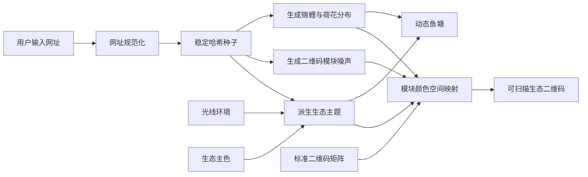
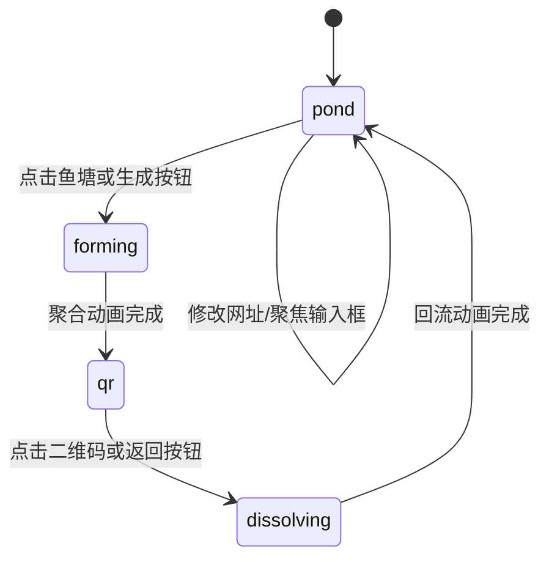

# 池码实现文档

本文档说明“池码｜会生长的生态二维码”的技术实现、数据流、核心算法、动画状态及扩展方式。项目是纯前端应用，不依赖业务后端；相同的网址、光线环境和生态主色会稳定生成相同的鱼塘与二维码视觉。

## 1. 实现目标

项目围绕三个目标设计：

1. 网址不仅是二维码内容，也是鱼塘生态的生成种子。
2. 鱼塘与二维码共享同一套生命分布和颜色主题，形成可解释的视觉关联。
3. 彩色二维码保留标准矩阵、静区和足够对比度，兼顾艺术表现与扫码可靠性。

## 2. 技术架构

| 层级 | 技术 | 职责 |
| --- | --- | --- |
| 页面层 | React 19 | 页面状态、交互控制、生态元素组合 |
| 样式与动画层 | CSS | 鱼塘布局、游动动画、光线效果、响应式适配 |
| 动态绘制层 | Canvas 2D | 水面涟漪、生态像素聚合、最终二维码绘制 |
| 二维码编码层 | `qrcode` | 生成标准二维码布尔矩阵 |
| 构建层 | Vite 6 | 开发服务器、资源打包和生产构建 |
| 托管层 | Worker | 静态资源响应与单页应用路由回退 |
| 测试层 | Node Test Runner | Worker 路由与构建产物验证 |

核心数据流如下：



## 3. 目录职责

```text
src/
  App.jsx                      状态、生成算法、Canvas 绘制与页面结构
  styles.css                   视觉样式、生态动画及响应式规则
  main.jsx                     React 挂载入口
public/assets/koi-pond/
  pond-base.png                鱼塘底图
  koi-red-white.png            锦鲤透明素材
  lotus-cluster.png            荷花透明素材
  reeds.png                    芦苇透明素材
worker/index.js                静态资源 Worker 与 SPA 回退
scripts/prepare-sites-build.mjs 组装托管所需构建目录
tests/sites-worker.test.mjs    Worker 和构建产物测试
docs/images/                   README 运行效果图
```

## 4. 视觉素材生成与抠图流程

鱼塘没有使用一张完整场景图直接播放，而是拆分为“底池 + 锦鲤 + 荷花 + 芦苇”四类图层。拆层后，网址才能分别控制生命数量和位置，主题系统也能独立调整各元素颜色，聚合二维码时还可以让不同生命元素执行不同的离场动画。

### 4.1 当前素材规格

| 文件 | 像素尺寸 | 颜色格式 | 透明背景 | 页面用途 |
| --- | ---: | --- | --- | --- |
| `pond-base.png` | 1575 × 998 | 24 位 RGB | 否 | 鱼塘、水面、石岸和岸边基础植被 |
| `koi-red-white.png` | 2172 × 724 | 32 位 ARGB | 是 | 根据网址重复实例化为多条锦鲤 |
| `lotus-cluster.png` | 1254 × 1254 | 32 位 ARGB | 是 | 生成荷花生命点，也用于二维码周围的弱装饰 |
| `reeds.png` | 1024 × 1536 | 32 位 ARGB | 是 | 布置在池塘三侧，构成前景层和岸边层次 |

锦鲤、荷花和芦苇必须保留 Alpha 通道，否则元素运动或换色时会带着矩形背景一起移动。鱼塘底图本身是完整矩形 RGB 图片，页面通过等距菱形 `clip-path` 限定可见区域，因此不依赖透明通道。

### 4.2 素材生成策略

无论使用生成模型、3D 渲染还是人工绘制，四类素材都需要先统一以下视觉约束：

- 视角：鱼塘采用等距或接近 45° 俯视；荷花偏俯视；芦苇保持直立；锦鲤保持清晰的水平主体轮廓。
- 光线：统一使用柔和的左上方主光，避免每个素材的阴影方向不同。
- 质感：写实但略带景观微缩模型感，细节清楚，不使用塑料般的高光。
- 构图：主体完整，鳍、叶尖、花瓣和草叶不能被画布裁断。
- 背景：需要抠图的单体优先生成在纯色、低纹理、与主体边缘反差明显的背景上。
- 尺寸：先生成高分辨率原图，再缩放到网页所需尺寸；不要先生成小图后强行放大。

推荐把生成任务拆开，不要要求模型一次生成完整鱼塘和所有动物。完整场景适合确定风格，真正进入页面的资产应分别生成：

```text
鱼塘底图：等距俯视、矩形浅水池、石岸、清澈水面、中心留空、不含鱼和荷花
锦鲤单体：完整红白锦鲤、水平伸展、鳍和尾巴清晰、单一干净背景、无投影
荷花组件：俯视荷花与荷叶小簇、边缘完整、单一干净背景、无容器
芦苇组件：完整芦苇和自然水草簇、根部聚拢、叶尖完整、单一干净背景、无花盆
```

生成时应明确排除文字、水印、画框、底座、容器、重复肢体、断裂叶片和强烈背景光晕。对锦鲤还要特别检查鱼鳍数量、尾部连接和触须，避免生成模型常见的结构错误。

### 4.3 为什么不能只做自动一键抠图

自动去背景适合产生第一版遮罩，但锦鲤鱼鳍、荷花瓣边缘、芦苇细叶都属于半透明或细长结构，一键抠图容易出现：

- 鳍膜、叶尖和细茎被误删。
- 原背景颜色残留成白边、黑边或绿色光晕。
- 细节处 Alpha 忽明忽暗，缩小后产生闪烁和锯齿。
- 原图的接触阴影被错误保留，移动时看起来像一块污渍。

因此当前这种分层场景适合采用“自动粗分 + 人工精修 + 页面复检”的流程。

### 4.4 抠图操作步骤

1. **保留生成原图**：原图不覆盖，抠图文件另存为带 Alpha 的工作文件。
2. **建立粗遮罩**：按颜色或主体识别去除大面积背景，先保留更多边缘，不急于缩小选区。
3. **精修硬边**：鱼身、荷叶和花瓣主体使用较硬边缘，避免缩小后轮廓发虚。
4. **精修软边**：鱼鳍、尾鳍、细叶和绒毛允许保留半透明像素，使用很小的羽化范围。
5. **清除背景污染**：沿轮廓去除原背景造成的白边、黑边或综合色边；重点检查鱼鳍末端、荷花外瓣和芦苇叶尖。
6. **处理阴影**：删除生成背景上的大面积投影，只保留贴合主体的细小自阴影。页面需要的落影统一由 CSS `drop-shadow` 生成。
7. **检查内部孔洞**：芦苇叶片之间、鱼鳍与身体之间、花瓣缝隙之间的背景都应透明，不能只抠除外围。
8. **裁切与留白**：按可见像素裁切，同时在四周保留少量安全边距，防止旋转、滤镜和阴影被裁掉。
9. **导出 PNG**：使用 sRGB、直通 Alpha 的 32 位 PNG；禁止导出为 JPEG，也不要在黑底或白底上预合成。
10. **缩放复检**：分别在原尺寸、页面实际尺寸和更小的移动端尺寸检查边缘，确认细节缩小时不会糊成一团。

边缘羽化没有固定万能数值。高分辨率素材通常只需要约 0.3～1 像素的视觉过渡；细叶和鱼鳍应以保留结构为优先。过度羽化会直接造成用户看到的“塑料贴纸感”或雾状白边。

### 4.5 四类素材的具体处理差异

#### 鱼塘底图

- 保留完整 RGB 图，避免对水面做复杂 Alpha 导致滤镜接缝。
- 生成时中心水域必须足够干净，不能预先画入固定锦鲤和荷花。
- 页面使用 `clip-path: polygon(...)` 裁成等距菱形，并以 `mix-blend-mode: multiply` 融入米白背景。
- 岸边植物属于底层静态细节，不能过高，否则会与独立芦苇层争夺视觉层级。

#### 锦鲤

- 保留鱼鳍和尾鳍的半透明质感，身体轮廓则保持清晰。
- 素材保持水平方向，运动轨迹中的旋转和翻转由 CSS 完成。
- 去掉外部投影，避免鱼游动时阴影与水面脱离。
- 页面通过 `hue-rotate`、亮度、饱和度和混合模式完成主题适配，同一张素材可以生成多条色彩略有差异的锦鲤。

#### 荷花与荷叶

- 采用接近俯视的组件，才能自然贴合水面。
- 花瓣、荷叶轮廓使用干净硬边，水珠等内部高光保留。
- 不在素材内加入水面倒影；倒影会随组件移动，破坏真实感。
- 页面按网址改变大小、旋转和位置，并添加轻微 `drop-shadow` 与漂浮动画。

#### 芦苇

- 这是最需要人工精修的素材，必须逐段检查细叶、细茎和内部空隙。
- 根部需要聚拢，方便把缩放和摆动原点放在底部。
- 大面积生成背景光晕必须去除，否则主题切换后会出现固定黄色或绿色光斑。
- 页面以 `transform-origin: 50% 100%` 从根部摇摆，左右岸通过镜像复用同一素材。

### 4.6 素材进入页面后的组合

四类素材的图层顺序为：

```text
二维码/过渡 Canvas
        ↑
前景芦苇
        ↑
荷花
        ↑
锦鲤 + 涟漪 Canvas
        ↑
鱼塘底图
```

鱼塘底图只渲染一次；锦鲤和荷花由 React 根据 `buildLife` 的结果重复创建；三组芦苇使用同一张透明 PNG，通过位置、镜像和动画延迟形成差异。这样可以减少素材数量，同时保持足够的视觉变化。

### 4.7 透明素材验收清单

每张透明素材进入 `public/assets/koi-pond` 前应完成以下检查：

- 在白色、黑色、灰色和当前米白页面背景上检查，没有彩边和矩形底色。
- 在棋盘格背景上检查内部孔洞，确认该透明的区域确实透明。
- 放大至 200% 检查断裂、毛边和孤立噪点。
- 缩小到页面实际尺寸检查轮廓，避免细节全部粘连。
- 打开六套主题色检查 CSS 滤镜，没有严重偏色、脏灰或高光溢出。
- 播放游动、漂浮和摆动动画，确认素材边缘不会闪烁。
- 检查四周安全边距，确保旋转和 `drop-shadow` 不被图片边界切断。
- 压缩后再次检查 Alpha 通道，不能为了体积把透明 PNG 错误转换为 JPEG。

### 4.8 素材迭代与可复现性

后续若继续替换生成素材，建议保留原始生成图、使用的描述词、负面约束、生成日期和精修文件，并按以下结构归档，但不要把超大源文件放进生产静态目录：

```text
art-source/
  prompts.md
  pond-base/source.*
  koi-red-white/source.*
  lotus-cluster/source.*
  reeds/source.*
public/assets/koi-pond/
  仅存放网页最终使用的 PNG
```

每次替换资产都应保持现有文件名或同步修改 `App.jsx`，并重新进行桌面端、移动端、三种光线和六套主色的视觉回归测试。

## 5. 页面状态模型

`App` 组件维护以下主要状态：

| 状态 | 含义 |
| --- | --- |
| `mode` | 当前光线环境：晨光、日光或夜色 |
| `palette` | 六套生态主色之一 |
| `url` | 已提交、用于生成最终二维码的网址 |
| `draftUrl` | 输入中的网址，用于实时驱动鱼塘生长 |
| `showQr` | 是否展示最终二维码 |
| `transitionState` | 鱼塘与二维码之间的动画阶段 |
| `isEditing` | 输入框是否处于实时编辑状态 |
| `muted` | 环境音按钮状态，目前预留为界面状态 |
| `credits` | 设计说明卡片是否打开 |
| `notice` | 分享操作的短暂提示文本 |

`transitionState` 是交互的核心状态机：



- `pond`：显示完整动态鱼塘。
- `forming`：锦鲤、荷花淡出，二维码模块从随机位置聚合。
- `qr`：显示完整生态二维码与颜色图例。
- `dissolving`：二维码消散，生态元素返回鱼塘。

定时器统一保存在 `transitionTimersRef` 中，在切换流程或组件卸载时清理，避免多次点击造成状态串扰。

## 6. 网址驱动的确定性生成

### 6.1 稳定哈希

`hashString` 使用 FNV-1a 风格的 32 位哈希，将任意网址转换为无符号整数。这个整数是整套生态的基础种子。

同一个网址始终得到同一个哈希，因此刷新、分享或再次输入时，生命分布保持一致。

### 6.2 伪随机序列

`seedRandom` 根据哈希种子产生可复现的伪随机数序列。它不是安全随机数，仅用于视觉生成。

```text
网址字符串
  → 32 位哈希
  → 可复现随机序列
  → 锦鲤数量、位置、大小、速度、方向
  → 荷花数量、锚点、大小、角度
```

### 6.3 生命分布

`buildLife(url)` 根据网址生成：

- 5 至 9 条锦鲤；网址越长，基础数量越多。
- 4 至 8 组荷花；在预设锚点附近产生自然偏移。
- 每条锦鲤独立的坐标、大小、游动时长、延迟、路径和色相扰动。
- 每组荷花独立的坐标、大小、旋转角度和漂浮延迟。
- `vitality` 活力值，用于表达网址长度带来的生态茂盛程度。

输入框编辑时，`draftUrl` 直接参与 `buildLife`，所以用户尚未离开输入框，鱼塘就会实时变化。380 毫秒防抖后，规范化的网址会写入正式状态和地址栏。

## 7. 鱼塘主题系统

### 7.1 三个主题输入

`derivePondTheme(text, mode, paletteIndex)` 同时读取：

1. 当前网址：提供轻微色相扰动。
2. 光线环境：控制亮度、饱和度和生态颜色混合目标。
3. 生态主色：作为鱼塘和二维码的颜色锚点。

六套主色为樱粉、鸢紫、锦橙、日金、荷青和湖蓝。每套预设分别定义水面、锦鲤和荷花素材的色相偏移，再根据光线环境派生水面、锦鲤、荷花和芦苇四种二维码颜色。

### 7.2 色彩安全

颜色工具函数负责：

- 十六进制颜色与 RGB 转换。
- 两种颜色的线性混合。
- 按 WCAG 公式计算相对亮度和对比度。
- 当模块颜色过浅时，逐步向深色混合，直到达到最低对比度。

页面使用米白色二维码背景。普通生态模块和定位区颜色都会经过对比度修正，防止浅色主题造成模块与静区难以区分。

### 7.3 CSS 变量联动

React 将主题结果写入 `.pond-stage` 的 CSS 自定义属性：

```css
--water-shift
--pond-brightness
--pond-base-brightness
--pond-saturation
--koi-theme-shift
--lotus-theme-shift
--reed-saturation
```

鱼塘底图、锦鲤、荷花和芦苇分别通过 `hue-rotate`、`saturate` 和 `brightness` 使用这些变量。切换主色或光线环境时，CSS 过渡会让整个生态平滑改变，而不是瞬间换色。

## 8. 生态二维码实现

### 8.1 保留标准矩阵

`QRCode.create(text, { errorCorrectionLevel: "H" })` 生成高容错二维码矩阵。程序只改变深色模块的绘制颜色，不改变模块真假值，因此二维码结构仍由标准编码库负责。

绘制时额外保留 4 个模块宽度的米白色静区。单元格使用整数像素，Canvas 设置 `image-rendering: pixelated`，减少边缘模糊。

### 8.2 鱼塘与二维码的空间映射

`ecologyModuleColor` 是两种视觉真正产生关联的关键：

1. 将二维码模块行列归一化为 `0～1` 空间坐标。
2. 将锦鲤和荷花在鱼塘中的百分比坐标同步归一化。
3. 计算当前模块与最近锦鲤、荷花的距离。
4. 靠近荷花的模块使用荷花色，靠近锦鲤的模块使用锦鲤色。
5. 靠近二维码边缘的部分模块使用芦苇色，模拟岸边生态。
6. 剩余模块依据“网址 + 行 + 列”的稳定噪声，在四种生态色之间分配。

因此，二维码颜色不是随机装饰：网址改变鱼塘生命坐标，生命坐标又改变二维码局部颜色分布。相同网址始终得到相同的关联结果。

三个定位区保留原有几何结构，但在经过对比度修正的生态色之间稳定分配颜色，使它们既明显又融入主题。

### 8.3 高清 Canvas 绘制

`drawQr` 读取元素显示尺寸，并按设备像素比放大 Canvas 内部位图。设备像素比上限设为 2，以在清晰度和性能之间取得平衡。窗口尺寸变化时会重新计算单元格和居中位置。

## 9. 动画与互动实现

### 9.1 生态元素动画

- 锦鲤使用三组 CSS 关键帧沿不同路径循环游动。
- 荷花以独立延迟轻微上下漂浮和旋转。
- 芦苇围绕底部原点摆动，模拟风吹效果。
- 切换为二维码时，锦鲤向外散开、荷花下沉；返回时执行反向动画。

这些动画的时长、延迟和方向由网址种子决定，所以不同网址拥有不同节奏。

### 9.2 水面指针涟漪

`rippleRef` Canvas 持续使用 `requestAnimationFrame` 绘制三层椭圆波纹。指针在鱼塘上移动时：

- 指针坐标决定涟漪中心。
- 波纹透明度增强。
- 鱼塘舞台产生少量视差位移。
- 指针离开后，舞台平滑回到中心，波纹保留较弱的环境呼吸感。

### 9.3 二维码聚合动画

`drawFormation` 先取得最终二维码中的所有有效模块，再为每个模块生成稳定的随机起点和出场顺序。

动画期间，每个模块从随机位置沿缓动曲线移动到等距投影坐标，绘制为菱形生态像素。980 毫秒后，过渡 Canvas 被完整、可扫描的正方形二维码替代。

聚合动画和最终二维码调用同一个 `ecologyModuleColor`，因此动画中的每个像素与最终模块颜色一致。

### 9.4 动效降级

当系统启用“减少动态效果”时，`prefers-reduced-motion` 媒体查询会将动画和过渡时长压缩到最低，降低持续运动带来的不适。

## 10. 分享状态编码

页面将光线环境、主色编号和网址组合成字符串，然后使用 Base64 URL 安全编码写入查询参数 `q`：

```text
原始状态 = 光线索引 + 主色索引 + 网址
分享地址 = 当前页面地址 + ?q=Base64URL(原始状态)
```

加载页面时，`readState` 解码参数并恢复三个状态。无参数、格式错误或越界时回退到默认值，不影响页面加载。

分享按钮优先调用 Web Share API；浏览器不支持时复制当前地址。分享链接同时包含网址、环境和主色，接收方看到的是同一方鱼塘。

## 11. 响应式与可访问性

页面以桌面端单屏沉浸布局为基础，在 700 像素以下调整鱼塘大小、控制区域、文字和二维码图例，保持移动端可操作性。低高度桌面窗口也有单独适配规则。

可访问性处理包括：

- 所有图标按钮提供中文 `aria-label`。
- 光线选择使用 `radiogroup`、`radio` 和 `aria-checked`。
- 主色按钮通过 `aria-pressed` 表示当前选择。
- 鱼塘支持 Enter 和空格键生成二维码。
- 提示信息使用 `role="status"`。
- 装饰图片使用空替代文本，避免屏幕阅读器重复播报。

## 12. 构建与托管

### 12.1 开发和生产构建

```bash
npm install
npm run dev
npm run build
```

Vite 将前端资源输出到 `dist/client`。随后 `prepare-sites-build.mjs` 检查必要文件，并准备：

```text
dist/client/index.html
dist/server/index.js
dist/.openai/hosting.json
```

### 12.2 单页应用路由回退

Worker 首先请求静态资源绑定。当资源不存在，并且请求是接受 HTML 的 `GET` 或 `HEAD` 请求时，才回退到 `/index.html`。

API 请求、非 HTML 请求和写请求不会被错误地转换为应用首页，可避免接口 404 被静默掩盖。

## 13. 测试与验收

执行：

```bash
npm run build
npm run test:sites
```

自动化测试覆盖：

1. 已存在的静态资源直接返回。
2. 未知前端路由回退到 `index.html`。
3. API 与 POST 请求保持原始 404。
4. 构建完成后，客户端、Worker 和托管配置文件均存在。

视觉验收建议至少覆盖：

- 六套主色 × 三种光线环境。
- 短网址、长网址、中文路径和带查询参数的网址。
- 桌面端与 390 像素左右的移动端宽度。
- 鱼塘生成、返回、连续切换以及输入中的实时变化。
- 使用多个常见扫码客户端验证最终二维码。

## 14. 二次开发入口

### 新增生态主色

同时扩展 `PALETTES`、`PALETTE_NAMES` 和 `ECOLOGY_PRESETS`，并检查所有光线环境下的二维码对比度。

### 新增生命元素

1. 在 `buildLife` 中生成稳定坐标和属性。
2. 在鱼塘 JSX 中渲染素材或 Canvas 图形。
3. 在 `derivePondTheme` 中增加对应生态色。
4. 在 `ecologyModuleColor` 中定义空间映射规则。
5. 在二维码颜色图例中补充说明。

### 调整二维码艺术风格

可修改模块绘制形状、生态颜色权重或聚合动画，但不应改变以下扫码基础条件：

- 保持标准二维码矩阵。
- 保持至少 4 模块静区。
- 定位区必须清晰。
- 前景与背景保持足够对比。
- 最终二维码使用整数边界绘制，避免抗锯齿污染模块。

### 接入真实环境音

当前 `muted` 仅控制按钮状态。若接入音频，建议在首次用户手势后创建或播放音频，并同步处理循环、音量、页面隐藏暂停和资源加载失败。

## 15. 当前边界

- 项目完全在浏览器中生成生态与二维码，没有服务端保存能力。
- 网址种子只追求稳定的视觉随机，不适用于密码学用途。
- 二维码颜色映射表达鱼塘生态关系，不编码额外业务数据。
- 素材通过 CSS 滤镜适配主题；若未来追求更真实的光照，需要升级为分层 Canvas、WebGL 或多套原始素材。
